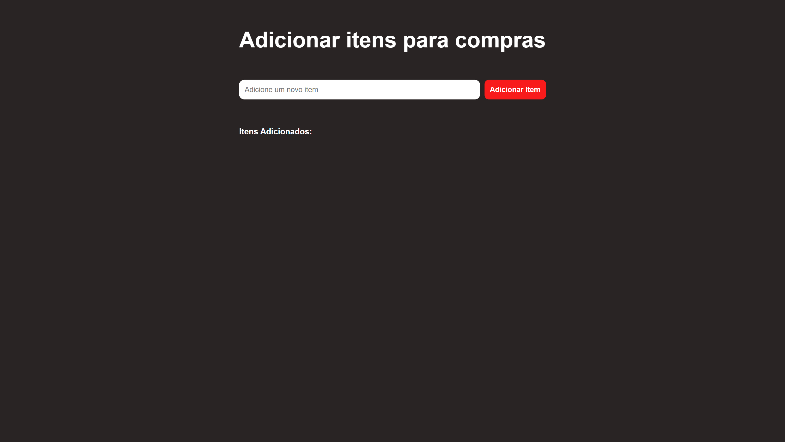

# Adicionador-de-Itens

Projeto construído para fins de aprendizado  

  <a href="#-tecnologias">Tecnologias</a>&nbsp;&nbsp;&nbsp;|&nbsp;&nbsp;&nbsp;
    <a href="#-projeto">Projeto</a>&nbsp;&nbsp;&nbsp;

 

 

 

## 👾 Tecnologias

Esse projeto foi desenvolvido com as seguintes tecnologias:

- HTML, CSS e JS
- Git e Github
- Figma

## 🖼 Projeto

Criei um mini projeto onde o usuário pode adicionar itens digitando no input. Sempre que ele insere um texto e confirma a ação, o item é adicionado à lista de forma dinâmica. Além disso, cada item criado possui um ícone de lixeira, permitindo que o usuário o remova facilmente com um clique.

- [Visite o projeto online](https://enzorafaelpassos.github.io/Adicionador-de-Itens/)